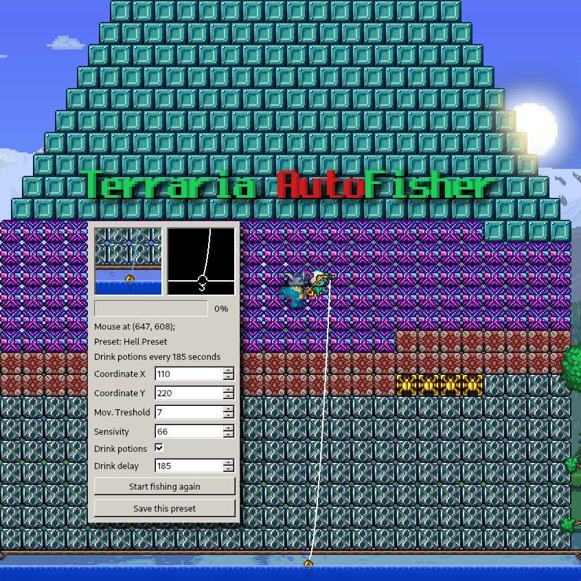
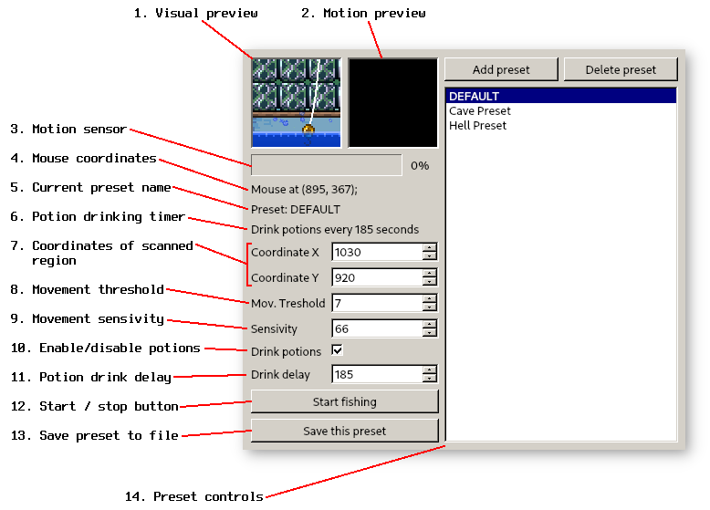

# Terraria AutoFisher
Terraria AutoFisher is an application designed for non-invasive automation of the fishing process in Terraria.
It uses computer vision to look at a certain region of your screen, and virtually presses a mouse key when
motion is detected.

### Installation
This program was tested to be working on Windows 7, Windows 10 and GNU/Linux with XOrg 11.
The pre-built Windows executable file should be published in GitHub releases. You can also run this program
from source. You should have Python 3 installed. 

Incomplete list of required libraries:
- `opencv-python`
- `pyautogui`
- `PyQt5`
- `configparser`
- `Pillow`

To install dependencies run `pip install -r requirements.txt`.

### Interface
At the program startup, a retro-styled window appears. 

1. This window shows the region the program looks it.
2. This window shows white sparkles at places where movement is detected.
3. This is the motion sensor. Its value depends on motion preview. When the sensor shows 100%, 
it means the program thinks that the float is moving.
4. Mouse coordinates. It helps you quickly find coordinates of the region of interest on your screen.
When fishing starts, this label is replaced by the label of the current program state.
5. Name of the currently selected preset. Closer to setting just so you don't overwrite a wrong preset.
6. How much time is left until program presses button "drink all potions".
7. The coordinates of the center of the scanned region. The size of this region is hardcoded to be 50x50px.
Use mouse (4) mouse coordinated to find your region of interest faster.
8. Movement threshold is a magic value that determines how much should a pixel change between frames in 
order to be even considered a movement. When pixel changes more than the threshold, this pixel appears
white in the (2) motion preview.
9. Sensitivity determines the behaviour of the (3) motion sensor. This is a multiple of the number of 
white pixels on (2) motion preview. For example, when sensitivity is `1`, it means that every pixel
should be white in (2) motion preview in order for the program to catch a fish. When sensitivity is `50`,
it means that only `1/50`the of the (2) motion preview should turn white in order for program to
understand it's time to catch a fish.
10. Program has functionality to periodically press `B` button in order for terraria character to drink
all potions. This is useful for fishing and luck potions, but can be disabled by this checkbox.
11. Change interval in seconds between drinking potions. AFAIK, fisher potions last for 3 minutes, so I've
set the default delay to 185 seconds.
12. When you press this button, the program becomes dangerous, because it can now click your mouse. It has
protection from spamming clicks, it can only click once per a couple of seconds. If something goes wrong,
close the program or click "Stop fishing".
13. Save preset to file. All the values we've talked about are saved into file with a name shown on 
(5) Current preset name label. 
14. Preset controls. It should be strainghtforward: you can create multiple presets and switch throught
them just by clicking their names. Don't forget to save current preset before switching to a new one,
deleting any preset or switching to other preset. Preset system is poorly tested, so I recommend backuping
the `config.ini` file if you are unsure. By the way, you can edit this file by hand.

### Usage
_DISCLAMER: I'm incredibly bad at fishing language._
1. Start Terraria, open your world and head to your fishing site. 
2. _Cast the line._ Switch to a fishing rod and click on the water, I mean.
3. Start AutoFisher and use its interface to find coordinates of the 
_float_ (thing that goes blup-blup when a fish eats bait)
4. Configure coordinates so that fishing rods' line, float and water surface are visible in preview window.
5. Configure the movent treshold just so that small ripples on the water surface are considered as "movements", meaning that corresponding pixels on the movement preview are sometimes white.
6. Configure sensivity so that water ripples don't cause 100% on the motion sensor.
7. **Remove the line from the water before starting AutoFisging.**
8. Save preset. (not necessary)
9. Click "start fishing". 
10. Cast the line into the whater, but make sure that your mouse cursor doesn't get into the scanned region.
11. Observe how AutoFisher behaves. Tweak settings if it doesn't work like expected.

### Recommendations
1. Equip anti-knockback shield just in case
2. Build a fishing shelter so no one disturbs you
3. Build a wall so that background doesn't interfere with the program
4. Place a couple of torches so that they are not visible in preview area but also so that the room has enough
light to be independent from the daylight cycle
